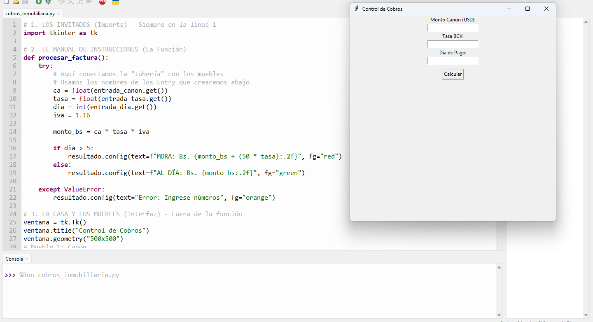

# 🚀 Flexi-Calc Python
> **"La pequeña gran herramienta que resuelve desde el cálculo más simple hasta el desafío financiero más complejo."**

## 🖼️ Vista Previa

---

## 📝 Descripción
Esta aplicación automatiza el flujo de cobros y facturación. Es ideal para entornos que requieren:
* **Conversión dinámica de divisas** (de USD a moneda local).
* **Cálculo automático de impuestos** (IVA).
* **Gestión de mora inteligente** (aplica penalizaciones por pagos tardíos).

## 🛠️ Tecnologías
* **Lenguaje:** Python 3.x
* **Interfaz Gráfica (GUI):** Desarrollada con Tkinter.

---
*Este proyecto forma parte de mi portafolio de herramientas de automatización de oficina.*
